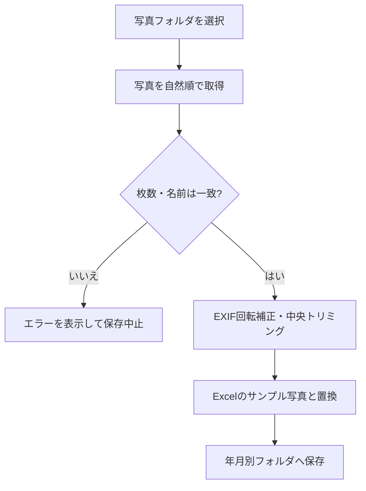

# Excel Photo Report Automation

Pythonを使用して、作業写真の整理・検査・向き補正を行い、既存のExcelテンプレートへ自動配置する業務効率化ツールです。

> [!NOTE]
> このリポジトリはポートフォリオ用です。実際の企業名・物件名・地域名・写真・Excelテンプレートは含めず、すべて架空のサンプル情報へ置き換えています。

## 目次

- [このツールについて](#このツールについて)
- [解決したかった課題](#解決したかった課題)
- [主な機能](#主な機能)
- [処理の流れ](#処理の流れ)
- [対応しているレイアウト](#対応しているレイアウト)
- [使用技術](#使用技術)
- [ディレクトリ構成](#ディレクトリ構成)
- [実行環境](#実行環境)
- [セットアップと実行方法](#セットアップと実行方法)
- [テスト内容と実行結果](#テスト内容と実行結果)
- [工夫したこと・頑張ったこと](#工夫したこと頑張ったこと)
- [苦労したこと](#苦労したこと)
- [今後改善したいこと](#今後改善したいこと)
- [公開用データについて](#公開用データについて)

## このツールについて

業務の中で、写真を1枚ずつ確認しながらExcelへ貼り付ける作業に時間がかかり、写真の順番やBefore／Afterを間違える可能性もあると感じました。

そこで、写真の整理からExcelへの配置までをPythonで自動化しました。既存のExcelテンプレートのレイアウトを維持しながら、写真だけを置き換えることを目的としています。

## 解決したかった課題

| 課題 | このツールでの対応 |
| --- | --- |
| 写真を1枚ずつExcelへ貼り付ける作業に時間がかかる | 写真を取得し、指定された写真枠へ自動配置する |
| 写真の順番やBefore／Afterを間違える可能性がある | 枚数とファイル名を事前に検査し、不一致の場合は保存を中止する |
| スマートフォン写真が回転したり、小さく表示されたりする | EXIF情報を画素へ反映してから、貼り付け用画像を作成する |
| 元のExcelテンプレートを誤って変更する可能性がある | 一時コピーを編集し、元のテンプレートを変更しない |
| 依頼元によってExcelのレイアウトが異なる | レイアウトごとにテンプレートクラスを分けて処理する |

## 主な機能

- 物件単位または依頼元単位での一括処理
- Before／After写真の自然順ソート
- Before／Afterの枚数とファイル名の一致確認
- 写真不足・過剰・ペア不一致時の保存中止
- EXIF情報を利用したスマートフォン写真の向き補正
- Excel内のサンプル写真の位置・大きさを利用した画像置換
- 元のExcelテンプレートを変更しない一時コピー方式
- マクロ有効ブック（`.xlsm`）を維持した保存
- HEIC画像をJPEGへ一括変換する補助コマンド
- 複数のExcelレイアウトに対応するテンプレートパターン

## 処理の流れ



## 対応しているレイアウト

| パターン | 概要 |
| --- | --- |
| Pattern 1 | 左側にBefore、右側にAfterを配置する基本形式 |
| Pattern 2 | 複数物件のBefore／Afterを1つの月次報告書へ配置する形式 |
| Pattern 3 | Before／Afterを使わず、作業区分ごとに配置する2ページ形式 |
| Pattern 4 | 複数物件を含むエリア別Excelの各シートへ配置する形式 |
| Pattern 5 | BeforeとAfterが別シートになっている例外形式 |

## 使用技術

| 技術 | 用途 |
| --- | --- |
| Python 3.12 | メイン処理 |
| pywin32 | Excel本体の操作 |
| Pillow | 画像の向き補正・変換・サイズ調整 |
| pillow-heif | HEIC画像の読み込み |
| unittest | 写真検査・画像処理・設定の自動テスト |

Excelの図形やマクロを維持したまま保存する必要があったため、`openpyxl`ではなく、Windows上のExcel本体を操作する`pywin32`を使用しています。

## ディレクトリ構成

```text
excel-photo-report-automation/
├── core/
│   ├── excel_workbook_editor.py  # Excelの起動・写真置換・保存
│   ├── image_processor.py        # 回転補正・変換・トリミング
│   └── sorter.py                 # 写真取得・並べ替え・事前検査
├── templates/
│   ├── base.py                   # テンプレート処理の共通クラス
│   └── template_pattern1.py ...  # レイアウト別の配置処理
├── tests/                        # Excelを起動しない単体テスト
├── config.py                     # 公開用の架空設定
├── convert_heic.py               # HEIC変換用の補助コマンド
├── main.py                       # ツールの実行入口
└── requirements.txt
```

## 実行環境

- Windows 10／11
- デスクトップ版Microsoft Excel
- Python 3.12

Excelを直接操作するため、Excelがインストールされていない環境やmacOS、Linuxでは報告書作成機能を実行できません。

## セットアップと実行方法

### 1. リポジトリを取得する

```bash
git clone https://github.com/IY-code-coder/excel-photo-report-automation.git
cd excel-photo-report-automation
```

### 2. 仮想環境を作成して必要なライブラリを入れる

```powershell
python -m venv .venv
.venv\Scripts\activate
pip install -r requirements.txt
```

### 3. プログラムを実行する

```powershell
python main.py
```

起動後、次のいずれかを選択します。

1. 単一対象処理
2. 依頼元コード単位の一括処理

### 4. 使用するフォルダを変更する場合

写真・テンプレート・出力先は、環境変数で切り替えられます。

```powershell
$env:PHOTO_REPORT_PHOTOS_DIR = "C:\sample\photos"
$env:PHOTO_REPORT_TEMPLATES_DIR = "C:\sample\templates"
$env:PHOTO_REPORT_OUTPUT_DIR = "C:\sample\outputs"
python main.py
```

環境変数を設定しない場合は、プロジェクト直下の`photos`、`templates_master`、`outputs`を使用します。フォルダ例は[docs/folder_structure.md](docs/folder_structure.md)にまとめています。

### HEIC画像を変換する場合

```powershell
python convert_heic.py C:\sample\photos --output C:\sample\converted_photos
```

## テスト内容と実行結果

写真の並べ替え、Before／Afterの事前検査、画像処理、公開用設定を対象に自動テストを実施しています。

### 実行コマンド

```bash
python -m unittest discover -s tests -v
```

### 実行結果

**実行日：2026年9月3日**

**結果：11件中11件合格（失敗0件）**

| No. | 対象 | テスト内容 | 期待する結果 | 実行結果 |
| --- | --- | --- | --- | --- |
| 1 | 公開用設定 | 登録されたすべての物件に依頼元コードとパターン番号が設定されているか確認 | 依頼元コードが所定の形式で、パターン番号が1～5の範囲になる | 合格 |
| 2 | 公開用設定 | 複数物件グループの取得順と、取得後の変更が元設定へ影響しないことを確認 | 表示順どおりのコピーが返り、元設定は変更されない | 合格 |
| 3 | 公開用設定 | エリア単位の物件が同じExcelテンプレートへ関連付けられているか確認 | 同一グループ内でテンプレートが一致し、出力名を取得できる | 合格 |
| 4 | 写真の並べ替え | `photo10`、`photo2`、`photo1`を読み込ませて順番を確認 | `photo1`、`photo2`、`photo10`の自然な順番になる | 合格 |
| 5 | Before／After検査 | 同名・同数のBefore／After写真を用意して検査 | すべての写真が正しいペアとして取得される | 合格 |
| 6 | Before／After検査 | BeforeとAfterで異なるファイル名を用意して検査 | 名前の不一致を検出し、エラーになる | 合格 |
| 7 | Before／After検査 | Before写真が必要枚数より少ない状態で検査 | 写真不足を検出し、エラーになる | 合格 |
| 8 | 写真の取得 | 処理済みを表す`_resized`付きファイルを混在させて検査 | 処理済みファイルは貼り付け対象から除外される | 合格 |
| 9 | 画像処理 | 横長画像を正方形の写真枠用に中央トリミング | 指定した縦横比の画像が作成される | 合格 |
| 10 | 画像処理 | 横長画像を最大幅・最大高さの範囲へ縮小 | 縦横比を維持したまま指定範囲内へ縮小される | 合格 |
| 11 | 一時ファイル | 別フォルダに同名写真を用意して画像処理 | 一時ファイル名が重複せず、上書きされない | 合格 |

### テスト結果の範囲

上記は、Excelを起動せずに実行できる処理について、実際に合格を確認した結果です。

Excelへの写真配置、図形・マクロの保持、保存後の表示については、Windowsとデスクトップ版Excelが必要なため、この実行結果には含めていません。未確認の項目を合格として記載しないよう、確認範囲を分けています。

## 工夫したこと・頑張ったこと

### 1. 元のテンプレートを壊さない設計

業務で使用するExcelには、画像以外にも図形・文字・マクロが含まれていました。元ファイルを直接編集すると、失敗時にテンプレートまで壊してしまうため、一時フォルダへ複製したファイルを編集し、成功した場合だけ指定先へ保存するようにしました。

### 2. 写真が回転する問題への対応

スマートフォンの写真には、画像そのものではなくEXIF情報として向きが記録されている場合があります。そのままExcelへ貼ると、保存後に回転したり小さく表示されたりしたため、貼り付け前にEXIF情報を実際の画素へ反映し、JPEGへ統一する処理を作成しました。

### 3. 写真のずれを防ぐ事前検査

写真が1枚不足した状態で順番どおりに貼ると、後ろの写真が前の枠へずれてしまいます。そこで、Before／Afterの枚数、ファイル名、必要枚数を貼り付け前に検査し、1つでも不一致があればExcelを保存しないようにしました。

### 4. 同じファイル名の衝突防止

異なる物件に同じ名前の写真が存在する場合でも一時画像が上書きされないよう、元の絶対パスから作ったハッシュ値を一時ファイル名へ付けています。

### 5. 複数レイアウトへの対応

依頼元によってExcelのシート構成や写真枠の並びが異なっていました。共通する画像処理・Excel操作と、レイアウトごとの処理を分け、テンプレートクラスを追加しやすい構成を意識しました。

## 苦労したこと

- Excel上では正しく見えても、保存し直すと写真の向きや大きさが変わる問題の原因特定
- 図形を削除するとExcel内の図形番号が変わるため、削除前に位置・大きさ・名前を記録する処理
- Before／Afterの不足によって、後続写真が誤った枠へ入らないようにする検査方法
- 1物件ずつ処理する形式と、複数物件を1つのExcelへまとめる形式の共通化
- 処理途中でエラーが発生しても、Excelのバックグラウンドプロセスや一時ファイルを残さない終了処理

## 今後改善したいこと

- 入力式の画面をGUIへ変更し、利用者が一覧から選択できるようにする
- Google Drive APIとGASを利用し、写真の取得とフォルダ整理も自動化する
- 依頼元・物件・テンプレートの対応をSQLiteまたはMySQLで管理する
- 実行結果とエラー履歴を保存し、再実行対象を確認しやすくする
- Excel操作部分をモック化し、テンプレートごとの自動テストを増やす
- 設定ファイルをより分かりやすくし、新しいレイアウトを追加しやすくする

## 公開用データについて

守秘のため、次のものはこのリポジトリに含めていません。

- 実際の企業名・物件名・店舗名・住所
- 実際の作業写真
- 業務で使用しているExcelテンプレートと完成報告書
- Google DriveのフォルダIDや認証情報
- 個人PC固有のファイルパス

`config.py`内の名称と対応関係は、動作構成を説明するための架空サンプルです。
